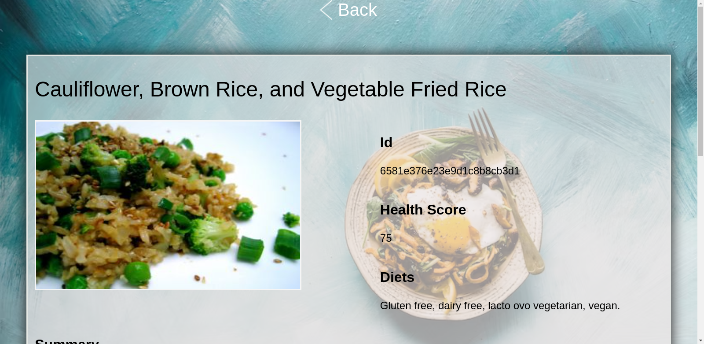
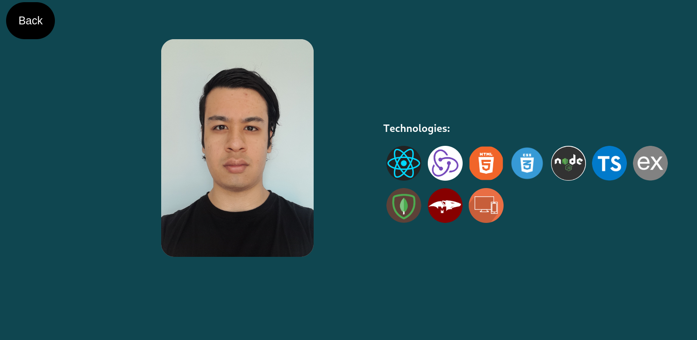

# Food Project!

This is a project that I made to learn how to use the [food API](https://spoonacular.com/food-api). with database in postgresql and sequelize, backend with express, and front with ReactJs, Redux and pure css.

I felt really consumed by the project and I learned a lot about the API and how to use it. i love the project and I am very happy to be a part of it. I hope you enjoy it.

Feel free to sort and filter the food recipes or create your own one and see how it works.☻♥

#### Technologies used:
-  React
-  Redux
-  Express
-  MongoDB
-  Mongoose
-  NodeJs
-  Pure css
-  Typescript

## Home

  

## Card Detail

  

## React Form

  

## About

  

